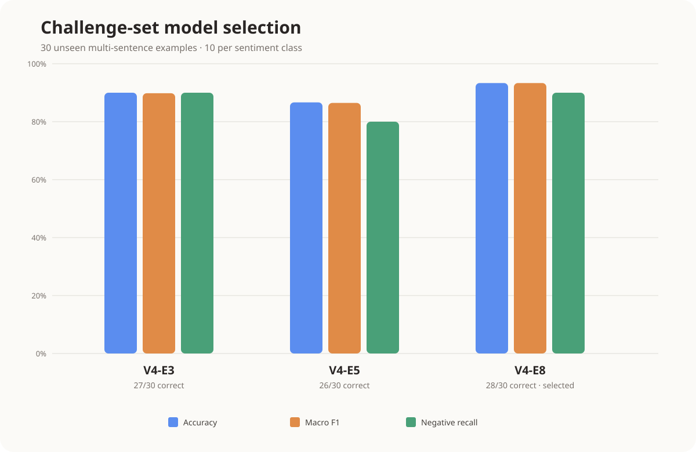

# Challenge-set evaluation and model selection

Evaluation date: August 30, 2026

## Decision

`journal-sentiment-v4-e8` was selected as the current application model. It achieved the highest accuracy and macro F1 on the challenge set while retaining 90% negative recall.

## Method

The three models use the same SetFit configuration, `BAAI/bge-small-en-v1.5` base model, V4 training data, and random seed. The controlled variable is the number of embedding-training epochs: 3, 5, or 8.

All models were evaluated on the same `challenge-v1` dataset containing 30 previously unseen, balanced examples:

- 10 negative
- 10 neutral
- 10 positive
- Multi-sentence entries
- Negation and emotional reversals
- Mixed positive and negative language
- Positive events with negative emotional responses
- Difficult events followed by relief or hope

## Results

| Model | Correct | Accuracy | Macro precision | Macro recall | Macro F1 | Negative recall | 95% accuracy CI |
|---|---:|---:|---:|---:|---:|---:|---:|
| V4-E3 | 27/30 | 90.00% | 89.93% | 90.00% | 89.82% | 90.00% | 74.38–96.54% |
| V4-E5 | 26/30 | 86.67% | 86.60% | 86.67% | 86.48% | 80.00% | 70.32–94.69% |
| **V4-E8** | **28/30** | **93.33%** | **93.33%** | **93.33%** | **93.33%** | **90.00%** | **78.68–98.15%** |

The 95% confidence intervals use the Wilson score method. Their substantial overlap reflects the small test set, so the ranking should be treated as provisional.

## Confusion matrices

Rows represent actual labels and columns represent predicted labels. Label order is negative, neutral, positive.

### V4-E3

| Actual \ Predicted | Negative | Neutral | Positive |
|---|---:|---:|---:|
| Negative | 9 | 0 | 1 |
| Neutral | 0 | 10 | 0 |
| Positive | 1 | 1 | 8 |

V4-E3 made three errors: one negative entry was predicted as positive, one positive entry as negative, and one positive entry as neutral.

### V4-E5

| Actual \ Predicted | Negative | Neutral | Positive |
|---|---:|---:|---:|
| Negative | 8 | 0 | 2 |
| Neutral | 0 | 10 | 0 |
| Positive | 1 | 1 | 8 |

V4-E5 made four errors and had the lowest negative recall. It missed two of the ten negative entries.

### V4-E8

| Actual \ Predicted | Negative | Neutral | Positive |
|---|---:|---:|---:|
| Negative | 9 | 0 | 1 |
| Neutral | 0 | 10 | 0 |
| Positive | 1 | 0 | 9 |

V4-E8 made two errors: one negative entry was predicted as positive and one positive entry was predicted as negative. It classified every neutral entry correctly.

## Why V4-E8 was selected

The selection uses macro F1 as the primary metric because it gives negative, neutral, and positive sentiment equal importance. Negative recall is considered separately because failing to detect negative journal sentiment is particularly relevant to the intended application.

V4-E8 provides the strongest current balance:

- Highest macro F1: 93.33%
- Highest accuracy: 93.33%
- Highest number of correct predictions: 28 of 30
- 90% negative recall, equal to V4-E3 and higher than V4-E5
- Perfect neutral recall
- One fewer error than V4-E3 and two fewer than V4-E5

V4-E3 was the second-best candidate. Although it required less training, it produced an additional error on the challenge set. V4-E5 was not selected because it had both the lowest macro F1 and the lowest negative recall.

## What this result supports

The evidence supports using V4-E8 as the current development model among these three candidates. It does not establish that eight epochs is universally optimal or that the model is suitable for clinical interpretation.

The challenge set has only 30 synthetic records. Because each mistake changes accuracy by 3.33 percentage points, a larger independently written dataset could change the ranking. Since this challenge set was used to select V4-E8, it should now be regarded as validation data rather than a final unbiased test set.

Before production use, evaluate the chosen model once on a larger untouched dataset of realistic journal entries. Future comparisons should also repeat training with multiple random seeds and report the mean and standard deviation of macro F1 and negative recall.

