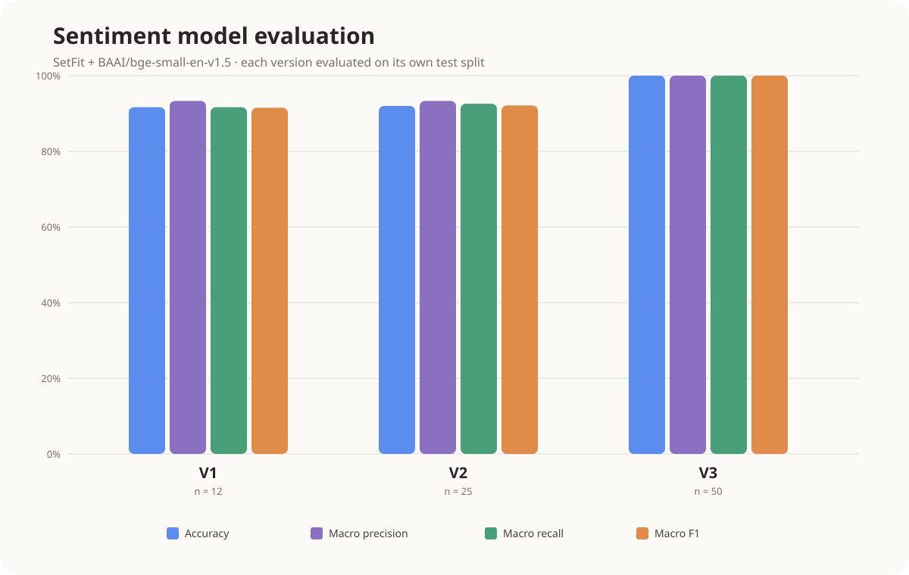

# Sentiment model evaluation: V1–V3

Evaluation date: August 30, 2026

All models use SetFit with `BAAI/bge-small-en-v1.5`. Each model was evaluated on the test split belonging to its own dataset version.

## Summary

| Model | Training samples | Test samples | Correct | Accuracy | Macro precision | Macro recall | Macro F1 | 95% accuracy CI |
|---|---:|---:|---:|---:|---:|---:|---:|---:|
| V1 | 30 | 12 | 11 | 91.67% | 93.33% | 91.67% | 91.53% | 64.61–98.51% |
| V2 | 50 | 25 | 23 | 92.00% | 93.33% | 92.59% | 92.13% | 75.03–97.78% |
| V3 | 100 | 50 | 50 | 100.00% | 100.00% | 100.00% | 100.00% | 92.87–100.00% |

The confidence intervals use the Wilson score method with a 95% confidence level. They are wide because the test datasets are small. V3's 100% means it classified this particular 50-example test set perfectly; it does not establish perfect performance on real journal entries.

## Confusion matrices

Rows are actual labels and columns are predicted labels, in the order negative, neutral, positive.

### V1

| Actual \ Predicted | Negative | Neutral | Positive |
|---|---:|---:|---:|
| Negative | 4 | 0 | 0 |
| Neutral | 0 | 3 | 1 |
| Positive | 0 | 0 | 4 |

V1 made one error: one neutral entry was predicted as positive.

### V2

| Actual \ Predicted | Negative | Neutral | Positive |
|---|---:|---:|---:|
| Negative | 8 | 0 | 0 |
| Neutral | 2 | 7 | 0 |
| Positive | 0 | 0 | 8 |

V2 made two errors: two neutral entries were predicted as negative.

### V3

| Actual \ Predicted | Negative | Neutral | Positive |
|---|---:|---:|---:|
| Negative | 16 | 0 | 0 |
| Neutral | 0 | 17 | 0 |
| Positive | 0 | 0 | 17 |

V3 classified all 50 examples correctly.

## Interpretation limitations

This comparison is descriptive, not a controlled learning-curve experiment. Each model uses a different test set, so the score change cannot be attributed only to increasing the training dataset. The examples are also short, synthetic, and clearly worded compared with realistic journal entries.

For a statistically stronger dataset-size experiment, evaluate V1, V2, and V3 against one fixed, independently created test set. Keep the base model, epochs, seed, and other hyperparameters unchanged. Repeat each training size with multiple seeds and report mean macro F1 with standard deviation.

