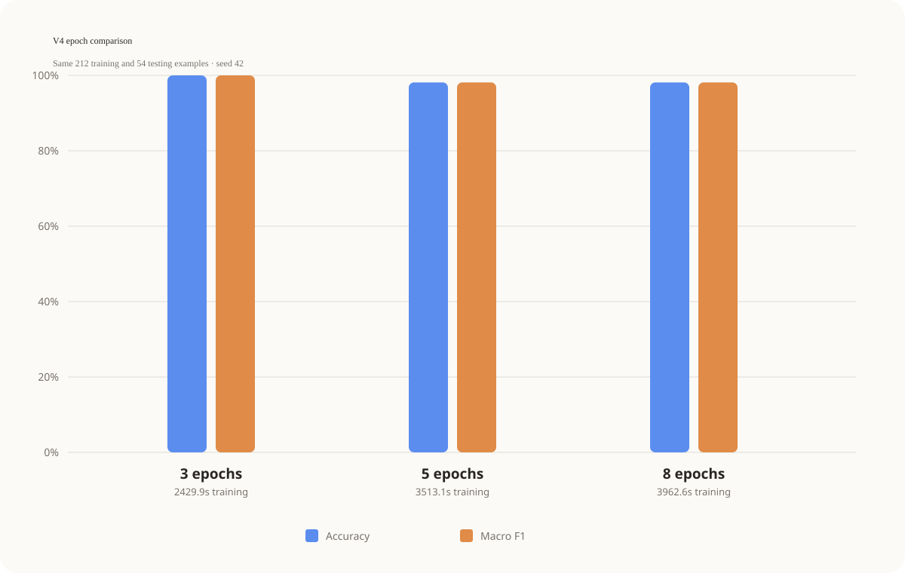

# V4 epoch comparison

All experiments use the same V4 training set (212 examples), test set (54 examples), base model (`BAAI/bge-small-en-v1.5`), and random seed (42). Only the epoch count changes.

| Epochs | Training seconds | Accuracy | Macro precision | Macro recall | Macro F1 |
|---:|---:|---:|---:|---:|---:|
| 3 | 2429.90 | 100.00% | 100.00% | 100.00% | 100.00% |
| 5 | 3513.05 | 98.15% | 98.25% | 98.15% | 98.15% |
| 8 | 3962.55 | 98.15% | 98.25% | 98.15% | 98.15% |

The highest macro F1 in this run was produced by **3 epochs** (100.00%). With only 54 test examples, treat small score differences cautiously. Repeating each configuration with multiple seeds is required for a stronger statistical conclusion.
